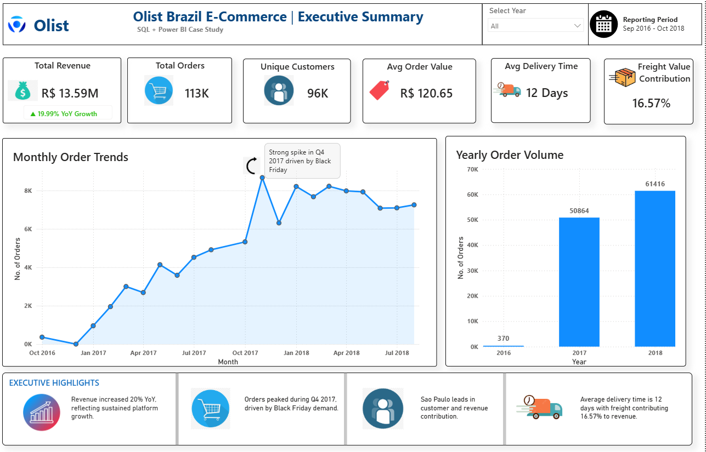
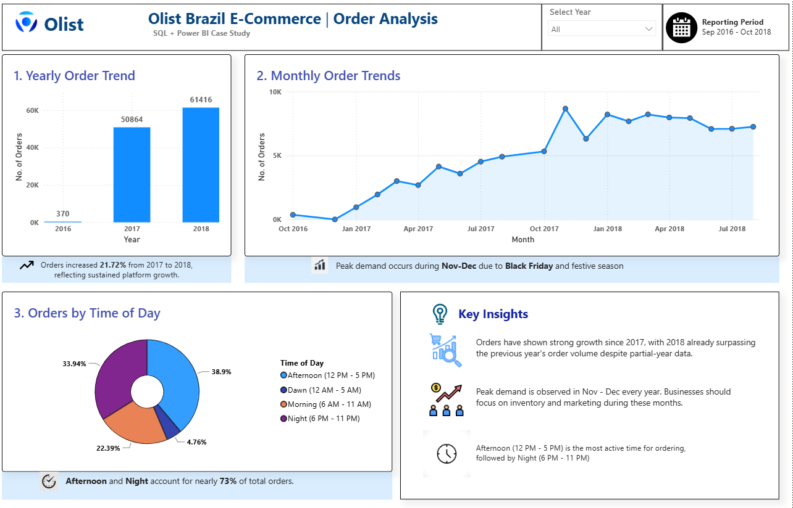
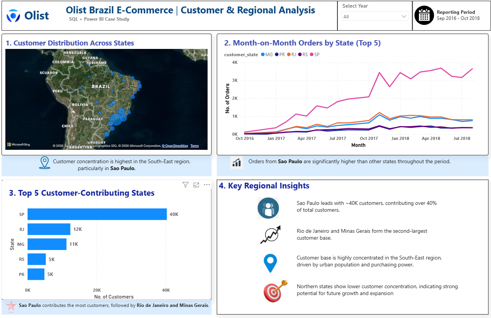
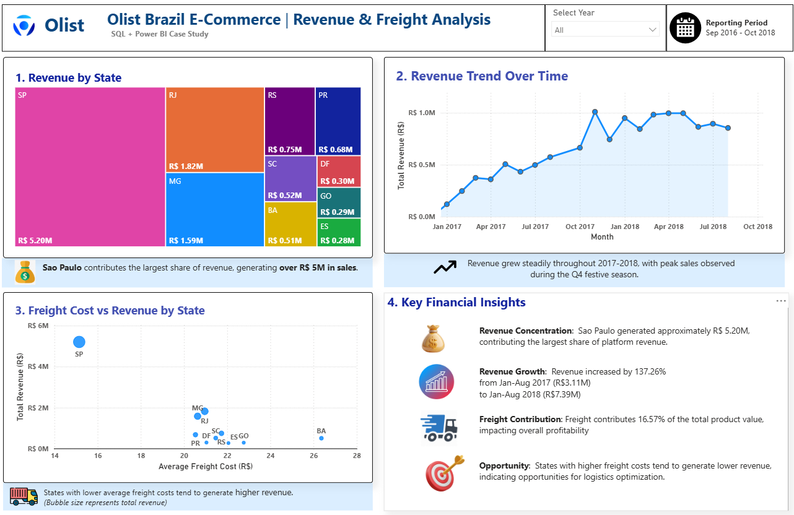
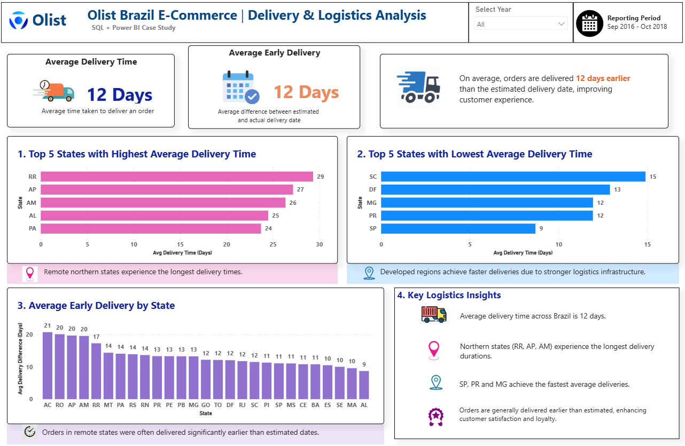
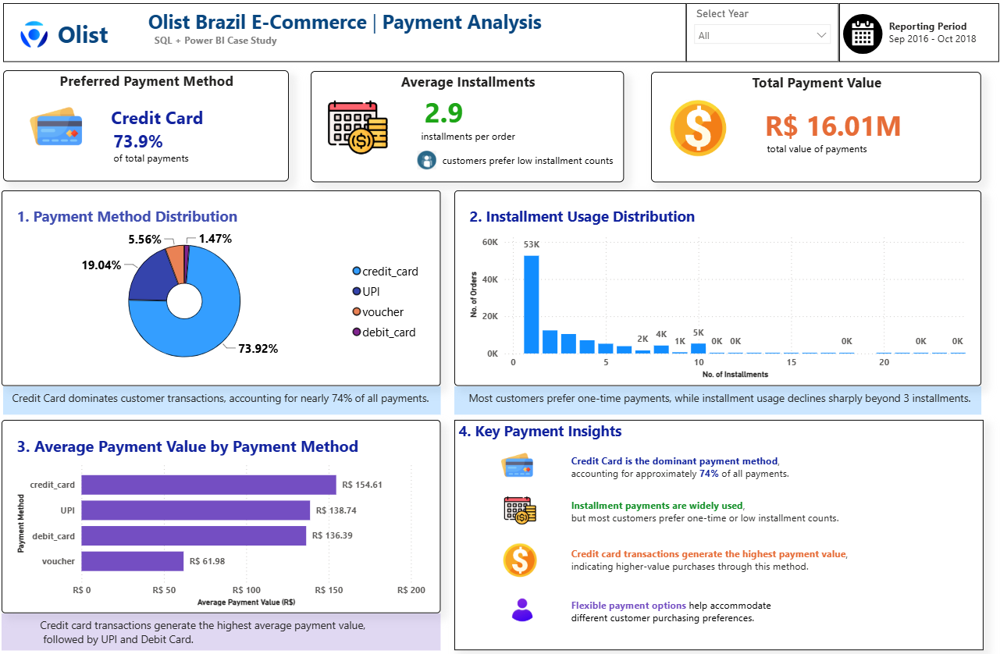

# Olist Brazil E-Commerce Analysis | SQL & Power BI Case Study

## Project Overview

As part of my Data Analytics learning journey, I wanted to work on a project that would allow me to apply SQL and Power BI to a real-world business scenario.

In this case study, I analysed Olist's e-commerce operations to understand customer behaviour, sales performance, delivery efficiency and payment preferences across Brazil.

The project began with SQL-based exploration to identify patterns and answer business questions. These insights were then transformed into an interactive Power BI dashboard to present findings in a clear and business-friendly manner.

---

## Business Questions Explored

Throughout the analysis, I focused on answering questions such as:

* How did order volume and revenue evolve over time?
* Which states contribute the most customers and revenue?
* How significant are freight costs in overall sales performance?
* How efficient is the delivery process across different regions?
* Which payment methods do customers prefer?
* What opportunities exist for future business growth?

---

## Tools Used

* SQL
* Power BI
* DAX
* GitHub

---

## Dashboard Overview

The dashboard was designed to provide a complete view of Olist's business performance through six analytical perspectives.

### Executive Summary

Provides a high-level overview of revenue, orders, customers, freight contribution and delivery performance.

---

### Order Analysis

Examines order growth, seasonality patterns and customer purchasing behaviour.

---

### Customer & Regional Analysis

Highlights customer concentration across Brazilian states and identifies the platform's key markets.

---

### Revenue & Freight Analysis

Explores revenue generation patterns and evaluates the impact of freight costs on business performance.

---

### Delivery & Logistics Analysis

Evaluates delivery performance across states and identifies regions with the fastest and slowest fulfilment times.

---

### Payment Analysis

Analyses customer payment preferences, installment behaviour and payment value distribution.

---

## Key Insights

Some of the most interesting findings from the analysis include:

* Revenue exceeded R$13.5M during the reporting period.
* São Paulo emerged as the largest contributor in terms of both customers and revenue.
* Strong order growth was observed between 2017 and 2018.
* Orders were generally delivered 11–12 days earlier than the estimated delivery date.
* Freight costs accounted for approximately 16.57% of product value.
* Credit Card represented nearly 74% of all customer transactions.

---

## Repository Structure

Dashboard → Power BI dashboard PDF and PBIX download link

Report → Detailed project report and business recommendations

SQL → SQL queries used during the analysis process

Screenshots → Dashboard page previews

---

## Project Files

### Dashboard

Contains the Power BI dashboard PDF and a link to the PBIX file hosted externally due to GitHub file size limitations.

### Report

Contains the final report documenting the project's findings, recommendations and conclusions.

### SQL

Contains the SQL queries used to explore the dataset and answer key business questions.

---

## What I Learned

Working on this project helped me strengthen my understanding of:

* SQL-based data analysis
* Business-focused KPI development
* Data storytelling and dashboard design
* DAX calculations in Power BI
* Translating raw data into actionable business insights

It also highlighted the importance of communicating findings clearly, rather than simply presenting numbers and charts.

---

## Final Thoughts

One of the most rewarding aspects of this project was seeing how individual SQL queries eventually came together to tell a broader business story.

This project reinforced the idea that effective data analysis is not just about finding answers in the data, but also about presenting those answers in a way that supports better decision-making.

Thank you for taking the time to review my work.

---

## Author

### Freddy Phil Stanly Eugin

Aspiring Data Analyst | SQL | Power BI | Python | Data Visualization

